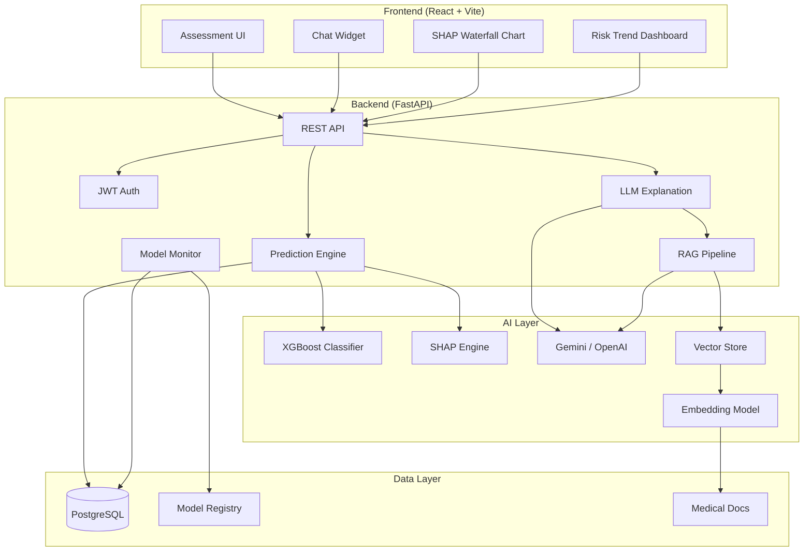

# HeartGuard — Project Analysis & Fullstack AI Roadmap

## What You've Built (Current State)

You have a solid **fullstack ML web app** with real architectural substance:

| Layer | Tech | Status |
|---|---|---|
| **ML Pipeline** | XGBoost + CalibratedClassifierCV, StandardScaler, RandomizedSearchCV | ✅ Well-built |
| **Backend API** | FastAPI (async), SQLAlchemy 2.0, PostgreSQL, Alembic migrations | ✅ Production-shaped |
| **Auth** | JWT + Argon2 hashing, protected routes, ownership checks | ✅ Solid |
| **Reports** | PDF (ReportLab) + multi-language audio (gTTS, 7 languages) | ✅ Impressive scope |
| **Frontend** | React + Vite, multi-step form, gauge visualization, routing | ⚠️ Functional but incomplete |
| **DevOps** | Docker Compose (Postgres + Backend + Frontend), Vercel deploy | ✅ Good foundation |

**Honest assessment:** This is a well-structured project that goes beyond a typical portfolio piece. The calibrated probabilities, ownership-scoped assessments, and multi-language audio reports show genuine engineering thought. But it's still a **traditional ML app**, not a "fullstack AI" project.

---

## Part 1: What Needs Fixing Right Now

These are bugs, code smells, and gaps that undermine the project's credibility before you add any new features.

### 🔴 Critical Issues

#### 1. Stale artifacts in project root
[xgb_model.pkl](file:///c:/heart-disease-prediction/xgb_model.pkl) and [scaler.pkl](file:///c:/heart-disease-prediction/scaler.pkl) and [heart.csv](file:///c:/heart-disease-prediction/heart.csv) sit at the project root, duplicating files in `backend/ml/artifacts/` and `backend/data/`. This is confusing—anyone cloning the repo won't know which model is canonical.

**Fix:** Delete root-level `.pkl` and `.csv` files. The canonical path is `backend/ml/artifacts/` and `backend/data/`.

#### 2. `recommendations.py` category matching in audio generator is broken
In [audio_generator.py:L149](file:///c:/heart-disease-prediction/backend/ml/audio_generator.py#L149), the audio generator filters recommendations by matching `rec["category"]` against plain strings like `"Lifestyle Modifications"`, but [recommendations.py](file:///c:/heart-disease-prediction/backend/ml/recommendations.py) actually outputs categories with emoji prefixes (e.g., `"💪 Lifestyle Modifications"`). **The audio generator will never match any lifestyle/diet/exercise recommendations.** This is a silent data loss bug.

#### 3. Risk threshold inconsistency across the codebase
- [model.py](file:///c:/heart-disease-prediction/backend/ml/model.py#L70-L75): `High > 60`, `Moderate > 30`
- [report_generator.py](file:///c:/heart-disease-prediction/backend/ml/report_generator.py#L71): `High > 50`
- [audio_generator.py](file:///c:/heart-disease-prediction/backend/ml/audio_generator.py#L133): `High > 50`
- [recommendations.py](file:///c:/heart-disease-prediction/backend/ml/recommendations.py#L14): `High > 0.5` (i.e., > 50%)

The model says `> 60` is High, but reports and audio say `> 50` is High. A patient scoring 55% would see "Moderate" on screen but "HIGH RISK" in their PDF. **This is a medical credibility issue.**

**Fix:** Define thresholds in a single `constants.py` and import everywhere.

#### 4. No `.env` in `.gitignore` properly
Your [.env](file:///c:/heart-disease-prediction/.env) (249 bytes) is tracked. This likely contains your `JWT_SECRET` and `DATABASE_URL`. Verify and scrub from git history if sensitive.

### 🟡 Code Quality Issues

#### 5. Empty `src/` directory
The root [src/](file:///c:/heart-disease-prediction/src) directory is empty. Dead weight—delete it.

#### 6. Debug/utility scripts exposed
[debug_auth.py](file:///c:/heart-disease-prediction/backend/debug_auth.py), [reset_password.py](file:///c:/heart-disease-prediction/backend/reset_password.py), and [predict_patient.py](file:///c:/heart-disease-prediction/backend/predict_patient.py) are development-only utilities sitting alongside production code. Move to `backend/scripts/` or add to `.gitignore`.

#### 7. Test coverage is minimal
Only 3 test files ([test_auth.py](file:///c:/heart-disease-prediction/backend/tests/test_auth.py), [test_model.py](file:///c:/heart-disease-prediction/backend/tests/test_model.py), [test_predict.py](file:///c:/heart-disease-prediction/backend/tests/test_predict.py)) with basic coverage. No tests for reports, audio, assessments, or edge cases. No frontend tests at all.

#### 8. `warnings.filterwarnings("ignore")` in training
[train_model.py:L32](file:///c:/heart-disease-prediction/backend/train_model.py#L32) blanket-suppresses warnings. This hides deprecation warnings from sklearn/xgboost that could break future versions.

#### 9. No rate limiting
The prediction and report endpoints have no rate limiting. A single user could hammer the gTTS API or generate thousands of PDF reports.

---

## Part 2: What "Fullstack AI" Actually Means

Right now, HeartGuard is a **fullstack ML app** — the model is a static classifier trained offline. To make it a **fullstack AI** project, you need to cross the gap from "model serving" to "AI-native application." Here's the progression:

```
Current: Static ML Model → API → Frontend
         (train once, serve forever)

Target:  LLM/AI Agent ↔ User Interaction ↔ Feedback Loop
         (contextual, generative, adaptive)
```

---

## Part 3: The Fullstack AI Roadmap

### Tier 1 — LLM-Powered Explanation Layer (Highest Impact, Easiest)

> **Goal:** Replace hardcoded recommendation templates with a context-aware AI that explains results like a doctor would.

#### A. AI Health Copilot Endpoint
Replace the static `recommendations.py` with an LLM call:

```
POST /api/explain
{
  "assessment_id": "uuid",
  "question": "What does my ST depression score mean?"
}
```

The backend sends the user's assessment data + question to an LLM (Gemini API / OpenAI) with a medical-context system prompt, and returns a personalized, conversational answer.

**Why this matters:** Your current recommendations are identical for every 55-year-old male with high cholesterol. An LLM can synthesize *all 13 features together* and give genuinely personalized guidance. This is the single biggest differentiator.

#### B. AI-Generated Report Narratives
Instead of the rigid template in `report_generator.py`, use an LLM to generate the PDF narrative section. The model sees all the input features and produces a flowing, personalized medical summary — not a mail-merge.

#### C. Conversational Follow-up (Chat Interface)
Add a chat widget on the results page where users can ask follow-up questions about their assessment. Backend maintains conversation context scoped to that assessment.

**New files needed:**
- `backend/app/routers/chat_router.py`
- `backend/ml/llm_client.py` (abstraction over Gemini/OpenAI)
- `frontend/src/components/ChatWidget.jsx`
- `frontend/src/pages/AssessmentDetail.jsx` (with chat embedded)

---

### Tier 2 — SHAP Explainability (XAI)

> **Goal:** Show *which features* drove the prediction, not just the score.

#### A. SHAP Feature Importance
After prediction, compute SHAP values for that patient's input and return them alongside the risk score:

```json
{
  "risk_score": 72.4,
  "risk_level": "High",
  "feature_importance": [
    { "feature": "ca", "impact": +18.3, "direction": "increases_risk" },
    { "feature": "thalach", "impact": -12.1, "direction": "decreases_risk" },
    { "feature": "oldpeak", "impact": +9.7, "direction": "increases_risk" }
  ]
}
```

#### B. Interactive SHAP Waterfall Chart (Frontend)
Render a waterfall/force plot in the frontend showing how each feature pushed the score up or down. This turns a black-box prediction into a transparent, explainable one.

**Why this matters for "fullstack AI":** Explainability (XAI) is the frontier of responsible ML. Adding SHAP shows you understand that AI isn't just about predictions — it's about trust.

---

### Tier 3 — RAG-Powered Medical Knowledge Base

> **Goal:** Ground the AI's recommendations in actual medical literature, not just LLM hallucinations.

#### A. Medical Knowledge Embeddings
Build a vector store (ChromaDB / Pinecone / pgvector on your existing Postgres) of:
- AHA/ACC clinical guidelines
- WHO cardiovascular disease fact sheets  
- Peer-reviewed meta-analyses on heart disease risk factors

#### B. RAG Pipeline
When generating explanations or recommendations, retrieve relevant medical passages and inject them into the LLM context. This gives citations and prevents hallucinated medical advice.

```
User Question → Embed → Vector Search → Top-K Passages → LLM + Context → Cited Answer
```

**New files:**
- `backend/ml/embeddings.py` (embedding model + indexing)
- `backend/ml/rag_pipeline.py` (retrieval + generation)
- `backend/data/medical_guidelines/` (source documents)

---

### Tier 4 — Advanced Features

#### A. Risk Trend Analysis
With assessment history already stored, build a time-series view:
- Plot risk score over time
- LLM-generated trend narrative ("Your risk has decreased 12% since March, likely driven by improved cholesterol readings")
- Predictive alerts ("Based on your trajectory, your risk may cross the High threshold in ~6 months without intervention")

#### B. Model Monitoring & Drift Detection
- Log every prediction with input features + output to a separate analytics table
- Compute distribution drift (PSI/KS test) periodically
- Dashboard showing model performance over time
- Alert when drift exceeds threshold → trigger retraining

#### C. Automated Retraining Pipeline
- When new data accumulates or drift is detected, trigger `train_model.py`
- Compare new model vs current model (you already have `compare_models.py`)
- Auto-promote if metrics improve, rollback if they don't
- Version models with timestamps

#### D. Multi-Model Ensemble with Model Registry
- Train multiple models (XGBoost, LightGBM, Random Forest, a small neural net)
- Serve predictions from an ensemble or let the system pick the best model per patient profile
- Model registry tracking versions, metrics, deployment status

---

## Part 4: Prioritized Implementation Order

| Phase | What | Effort | Resume Impact |
|---|---|---|---|
| **Phase 0** | Fix bugs from Part 1 (thresholds, audio bug, stale files) | 1 day | Prevents credibility damage |
| **Phase 1** | LLM Explanation Endpoint + AI Report Narratives | 2-3 days | 🔥🔥🔥 Transforms project identity |
| **Phase 2** | SHAP Explainability + Waterfall Charts | 2 days | 🔥🔥🔥 Shows XAI knowledge |
| **Phase 3** | Chat Interface (conversational follow-up) | 2-3 days | 🔥🔥 Shows full-stack AI UX |
| **Phase 4** | RAG Pipeline + Medical Knowledge Base | 3-4 days | 🔥🔥 Shows production AI architecture |
| **Phase 5** | Risk Trends + Model Monitoring | 3-4 days | 🔥 Shows MLOps maturity |
| **Phase 6** | Retraining Pipeline + Model Registry | 2-3 days | 🔥 Shows production ML lifecycle |

---

## Part 5: Architecture After Fullstack AI Upgrade



---

## Summary

Your project is **genuinely well-built for a traditional ML fullstack app** — async FastAPI, proper auth, calibrated predictions, multi-language reports, Docker orchestration. That's more than most portfolio projects achieve.

But to cross into **"fullstack AI"** territory, the key gap is: **your app doesn't use AI as a thinking tool, only as a classification function.** The roadmap above progressively adds:

1. **LLM-powered reasoning** (explanations, conversations)
2. **Explainability** (SHAP, transparency)
3. **Grounded knowledge** (RAG, citations)
4. **Adaptive intelligence** (monitoring, retraining, drift detection)

Phase 1 (LLM explanation layer) is the highest-impact, lowest-effort change. It takes HeartGuard from "ML model with a UI" to "AI-powered health copilot" — a fundamentally different category of project.
