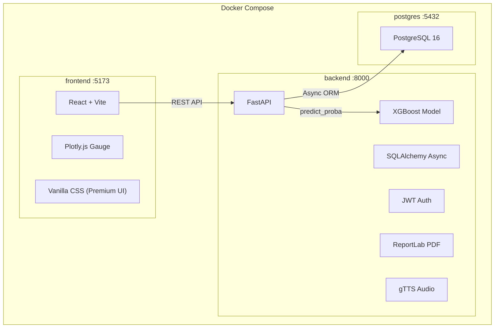

# HeartGuard — Full-Stack Rewrite

Transform the Streamlit prototype into a **production-grade full-stack application** with React frontend, FastAPI backend, PostgreSQL database, JWT auth, and Docker orchestration — while preserving every existing feature.

---

## Architecture Overview



## User Review Required

> [!IMPORTANT]
> **Streamlit app will be removed.** The existing `app.py` will be deleted and replaced by the React + FastAPI stack. The ML model files (`xgb_model.pkl`, `scaler.pkl`) and training script (`train_model.py`) will be preserved and moved into the backend.

> [!IMPORTANT]
> **PostgreSQL via Docker.** The database runs inside Docker Compose — no local PostgreSQL installation required. Data persists via a Docker volume.

> [!WARNING]
> **All existing features are preserved:**
> - ✅ XGBoost prediction with calibrated probabilities
> - ✅ Interactive Plotly gauge chart (now via Plotly.js in React)
> - ✅ Input validation against medical ranges
> - ✅ Personalized health recommendations (4 categories)
> - ✅ PDF report generation & download
> - ✅ Multi-language audio reports (8 languages) & download
> - ✅ Risk-tier classification (high/low)
> - 🆕 User authentication (register/login)
> - 🆕 Assessment history dashboard
> - 🆕 Docker deployment
> - 🆕 Backend API tests

---

## Proposed Changes

### Project Structure (Final)

```
heart-disease-prediction/
├── docker-compose.yml
├── README.md
├── .gitignore
├── .env.example
│
├── backend/
│   ├── Dockerfile
│   ├── requirements.txt
│   ├── alembic.ini
│   ├── alembic/
│   │   ├── env.py
│   │   └── versions/
│   │       └── 001_initial.py
│   ├── app/
│   │   ├── __init__.py
│   │   ├── main.py              # FastAPI app + CORS
│   │   ├── config.py            # Settings via pydantic-settings
│   │   ├── database.py          # Async engine + session
│   │   ├── models.py            # SQLAlchemy ORM models (User, Assessment)
│   │   ├── schemas.py           # Pydantic request/response schemas
│   │   ├── auth.py              # JWT creation + password hashing
│   │   ├── dependencies.py      # get_current_user dependency
│   │   └── routers/
│   │       ├── __init__.py
│   │       ├── auth_router.py       # POST /register, /login
│   │       ├── predict_router.py    # POST /predict
│   │       ├── report_router.py     # GET /reports/pdf, /reports/audio
│   │       └── assessment_router.py # GET/DELETE /assessments
│   ├── ml/
│   │   ├── __init__.py
│   │   ├── model.py             # Model loading + prediction logic
│   │   ├── recommendations.py   # Health recommendations engine
│   │   ├── report_generator.py  # PDF generation (ReportLab)
│   │   ├── audio_generator.py   # Multi-language audio (gTTS)
│   │   ├── validation.py        # Input validation
│   │   └── artifacts/
│   │       ├── xgb_model.pkl
│   │       └── scaler.pkl
│   ├── data/
│   │   └── heart.csv
│   ├── train_model.py           # Preserved training script
│   └── tests/
│       ├── __init__.py
│       ├── conftest.py
│       ├── test_auth.py
│       ├── test_predict.py
│       └── test_model.py
│
├── frontend/
│   ├── Dockerfile
│   ├── nginx.conf
│   ├── package.json
│   ├── vite.config.js
│   ├── index.html
│   ├── public/
│   └── src/
│       ├── main.jsx
│       ├── App.jsx
│       ├── index.css            # Design system (dark theme, variables)
│       ├── api/
│       │   └── client.js        # Axios instance with JWT interceptor
│       ├── context/
│       │   └── AuthContext.jsx   # React Context for auth state
│       ├── components/
│       │   ├── Navbar.jsx
│       │   ├── GaugeChart.jsx       # Plotly.js gauge
│       │   ├── HealthForm.jsx       # Multi-step input form
│       │   ├── RiskResult.jsx       # Risk display + recommendations
│       │   ├── ReportDownload.jsx   # PDF + audio download buttons
│       │   ├── AssessmentCard.jsx   # History card component
│       │   └── ProtectedRoute.jsx
│       ├── pages/
│       │   ├── Landing.jsx
│       │   ├── Login.jsx
│       │   ├── Register.jsx
│       │   ├── Dashboard.jsx        # Assessment history
│       │   └── Assess.jsx           # Main prediction page
│       └── styles/
│           ├── landing.css
│           ├── auth.css
│           ├── dashboard.css
│           ├── assess.css
│           └── components.css
```

---

### Backend — FastAPI

#### [NEW] [Dockerfile](file:///c:/heart-disease-prediction/backend/Dockerfile)
- Python 3.11 slim image
- Install dependencies, copy app code
- Expose port 8000, run with uvicorn

#### [NEW] [requirements.txt](file:///c:/heart-disease-prediction/backend/requirements.txt)
- `fastapi[standard]==0.136.3`, `uvicorn`, `sqlalchemy[asyncio]==2.0.50`, `asyncpg==0.31.0`
- `alembic==1.18.4`, `pydantic-settings`, `PyJWT[crypto]==2.13.0`, `pwdlib[argon2]`
- `xgboost`, `scikit-learn`, `pandas`, `numpy`
- `reportlab`, `gTTS`, `plotly`
- `pytest`, `pytest-asyncio`, `httpx` (for testing)

#### [NEW] [main.py](file:///c:/heart-disease-prediction/backend/app/main.py)
- FastAPI app with lifespan (load model on startup)
- CORS middleware allowing frontend origin
- Include all routers under `/api` prefix
- Health check endpoint at `/api/health`

#### [NEW] [config.py](file:///c:/heart-disease-prediction/backend/app/config.py)
- Pydantic `Settings` class reading from environment:
  - `DATABASE_URL`, `JWT_SECRET`, `JWT_ALGORITHM`, `JWT_EXPIRE_MINUTES`
  - `CORS_ORIGINS`

#### [NEW] [database.py](file:///c:/heart-disease-prediction/backend/app/database.py)
- Async SQLAlchemy engine using `asyncpg`
- `AsyncSession` factory
- `get_db` async dependency

#### [NEW] [models.py](file:///c:/heart-disease-prediction/backend/app/models.py)
- **User**: id, email, hashed_password, full_name, created_at
- **Assessment**: id, user_id (FK), input_data (JSON), risk_score, recommendations (JSON), created_at

#### [NEW] [schemas.py](file:///c:/heart-disease-prediction/backend/app/schemas.py)
- `UserRegister`, `UserLogin`, `TokenResponse`
- `PredictionRequest` (13 health features with validation)
- `PredictionResponse` (risk_score, risk_level, recommendations)
- `AssessmentResponse`, `AssessmentListResponse`

#### [NEW] [auth.py](file:///c:/heart-disease-prediction/backend/app/auth.py)
- `hash_password` / `verify_password` using `pwdlib` with Argon2id (passlib is unmaintained)
- `create_access_token` / `decode_token` using `PyJWT` (python-jose is abandoned)

#### [NEW] [dependencies.py](file:///c:/heart-disease-prediction/backend/app/dependencies.py)
- `get_current_user` — decode JWT from `Authorization: Bearer` header

#### [NEW] [auth_router.py](file:///c:/heart-disease-prediction/backend/app/routers/auth_router.py)
- `POST /api/auth/register` — create user, return token
- `POST /api/auth/login` — verify credentials, return token

#### [NEW] [predict_router.py](file:///c:/heart-disease-prediction/backend/app/routers/predict_router.py)
- `POST /api/predict` — accepts health data, runs XGBoost prediction, generates recommendations, saves assessment to DB, returns result
- Uses the existing model loading + prediction logic from `utils.py`

#### [NEW] [report_router.py](file:///c:/heart-disease-prediction/backend/app/routers/report_router.py)
- `GET /api/reports/{assessment_id}/pdf` — generate and stream PDF
- `GET /api/reports/{assessment_id}/audio?lang=en` — generate and stream MP3

#### [NEW] [assessment_router.py](file:///c:/heart-disease-prediction/backend/app/routers/assessment_router.py)
- `GET /api/assessments` — list user's past assessments
- `GET /api/assessments/{id}` — get single assessment detail
- `DELETE /api/assessments/{id}` — delete an assessment

#### [NEW] [ml/model.py](file:///c:/heart-disease-prediction/backend/ml/model.py)
- Singleton model loader (load pkl files once)
- `predict(input_data) -> (risk_score, risk_level)`
- Preserves `custom_scaling` function from `train_model.py`

#### [NEW] [ml/recommendations.py](file:///c:/heart-disease-prediction/backend/ml/recommendations.py)
- Exact port of `generate_health_recommendations()` from `utils.py`

#### [NEW] [ml/report_generator.py](file:///c:/heart-disease-prediction/backend/ml/report_generator.py)
- Exact port of `ReportGenerator` class from `utils.py`

#### [NEW] [ml/audio_generator.py](file:///c:/heart-disease-prediction/backend/ml/audio_generator.py)
- Exact port of `generate_audio_report()` from `utils.py`

#### [NEW] [ml/validation.py](file:///c:/heart-disease-prediction/backend/ml/validation.py)
- Exact port of `validate_input()`, `VALID_RANGES`, `CATEGORICAL_MAPPINGS`

#### [MOVE] train_model.py → backend/train_model.py
- Update paths to save artifacts to `ml/artifacts/`

#### [MOVE] xgb_model.pkl, scaler.pkl → backend/ml/artifacts/
#### [MOVE] heart.csv → backend/data/

#### [NEW] Alembic migration
- `001_initial.py` — create `users` and `assessments` tables

#### [NEW] Tests
- `test_auth.py` — register, login, invalid credentials
- `test_predict.py` — valid prediction, invalid input, unauthorized
- `test_model.py` — model loading, prediction output range

---

### Frontend — React + Vite

#### [NEW] [Dockerfile](file:///c:/heart-disease-prediction/frontend/Dockerfile)
- Multi-stage: Node 20 build → Nginx serve
- `nginx.conf` proxies `/api` to backend

#### [NEW] Design System ([index.css](file:///c:/heart-disease-prediction/frontend/src/index.css))
- **Dark theme** with CSS custom properties
- Color palette: deep navy (`#0a0e27`), electric blue (`#3b82f6`), emerald accents
- Google Fonts: Inter
- Glassmorphism cards, smooth transitions, micro-animations
- Responsive breakpoints

#### [NEW] Pages

| Page | Route | Features |
|------|-------|----------|
| **Landing** | `/` | Hero section, feature cards, CTA to register |
| **Register** | `/register` | Email + password form with validation |
| **Login** | `/login` | Login form, link to register |
| **Dashboard** | `/dashboard` | Past assessments grid, delete option, quick stats |
| **Assess** | `/assess` | Multi-step health form → gauge result → recommendations → download reports |

#### [NEW] Components

| Component | Purpose |
|-----------|---------|
| `Navbar` | Navigation with auth state (login/logout/user name) |
| `HealthForm` | Multi-step form with all 13 inputs, validation, tooltips |
| `GaugeChart` | Plotly.js gauge (port of `create_gauge_chart`) |
| `RiskResult` | Risk level banner + expandable recommendation sections |
| `ReportDownload` | PDF download + language selector + audio download |
| `AssessmentCard` | Card showing date, risk score, risk level for history |
| `ProtectedRoute` | Redirects to `/login` if not authenticated |

#### [NEW] API Client ([client.js](file:///c:/heart-disease-prediction/frontend/src/api/client.js))
- Axios instance with `baseURL: /api`
- Request interceptor attaching JWT from localStorage
- Response interceptor handling 401 → redirect to login

#### [NEW] Auth Context ([AuthContext.jsx](file:///c:/heart-disease-prediction/frontend/src/context/AuthContext.jsx))
- React Context providing `user`, `login()`, `logout()`, `register()`
- Persists token in localStorage

---

### Infrastructure

#### [NEW] [docker-compose.yml](file:///c:/heart-disease-prediction/docker-compose.yml)
```yaml
services:
  postgres:
    image: postgres:17.10-bookworm
    volumes: [pgdata:/var/lib/postgresql/data]
    healthcheck: pg_isready

  backend:
    build: ./backend
    depends_on: [postgres]
    env_file: .env

  frontend:
    build: ./frontend
    depends_on: [backend]
    ports: ["3000:80"]
```

#### [NEW] [.env.example](file:///c:/heart-disease-prediction/.env.example)
- Template with all required environment variables

#### [MODIFY] [.gitignore](file:///c:/heart-disease-prediction/.gitignore)
- Add `node_modules/`, `.env`, `dist/`, `postgres-data/`

#### [MODIFY] [README.md](file:///c:/heart-disease-prediction/README.md)
- Rewrite with full-stack setup instructions, architecture diagram, API docs

#### [DELETE] app.py — replaced by FastAPI backend
#### [DELETE] utils.py — logic split into backend/ml/ modules
#### [DELETE] requirements.txt (root) — moved to backend/

---

## Verification Plan

### Automated Tests
```bash
# Backend tests
cd backend && pytest tests/ -v

# Docker build test
docker compose build
docker compose up -d
# Wait for health checks
curl http://localhost:8000/api/health
curl http://localhost:3000
```

### Manual Verification
1. Register a new user → verify JWT returned
2. Login with credentials → verify dashboard loads
3. Fill health form → submit → verify gauge chart + recommendations render
4. Download PDF report → verify content matches input
5. Generate audio in 3 different languages → verify playback
6. Check assessment history shows past predictions
7. Delete an assessment → verify removed from list

### Feature Parity Check
- [ ] XGBoost prediction produces same scores as old Streamlit app
- [ ] All 13 input fields present with same validation ranges
- [ ] Gauge chart matches the original Plotly visualization
- [ ] All 4 recommendation categories generated correctly
- [ ] PDF report contains all sections (executive summary, health info, recommendations)
- [ ] Audio reports work in all 8 languages
- [ ] Risk threshold (50%) correctly classifies high/low risk
